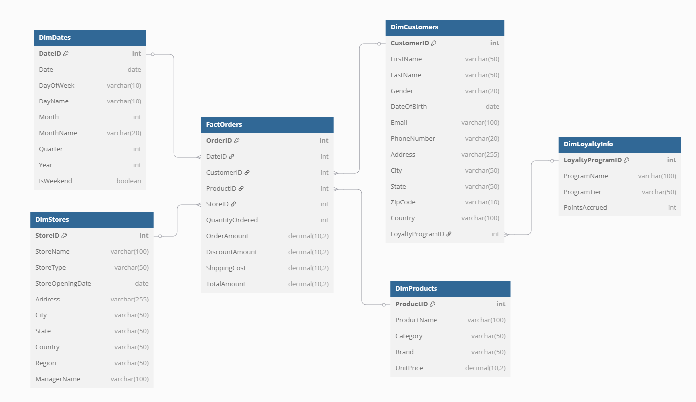
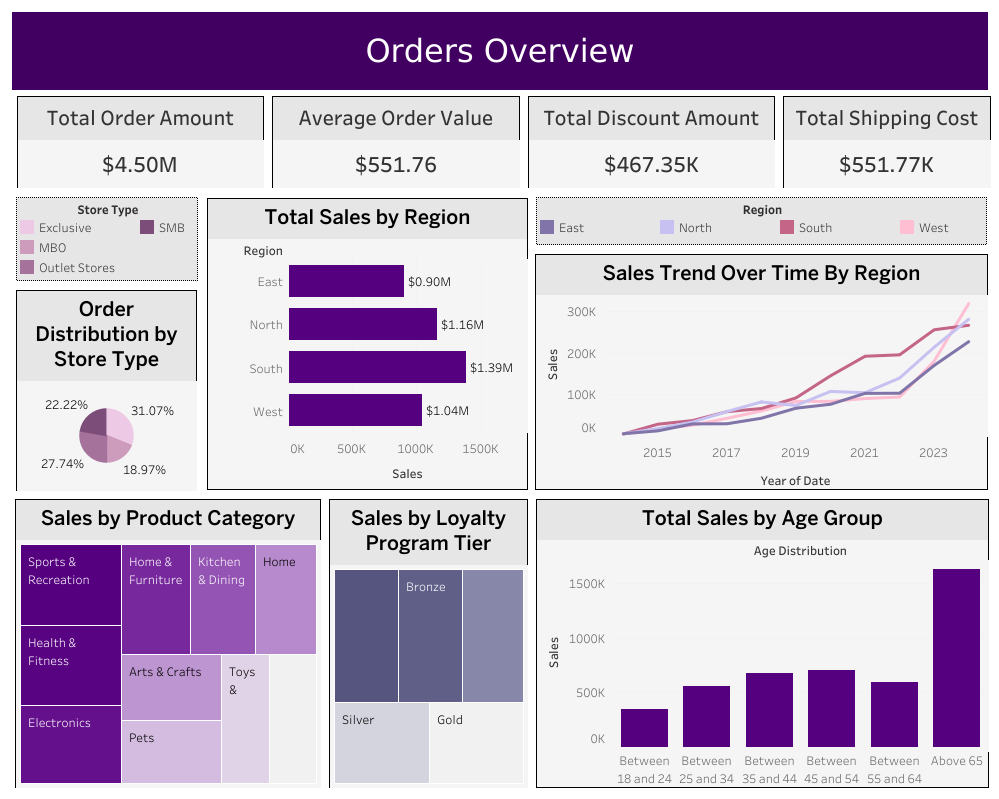

# E-Commerce Data Warehouse Project

A data warehousing solution for an e-commerce business, built using Snowflake and visualized with Tableau. This project demonstrates the end-to-end implementation of a data warehouse, from data generation to visualization.

🔗 **[Click here to view the dashboard on Tableau Public](https://public.tableau.com/views/OrdersOverviewDashboard/Dashboard1?:language=en-US&:sid=&:redirect=auth&:display_count=n&:origin=viz_share_link)**  

## Project Overview

This project implements a star schema data warehouse for an e-commerce business with the following components:
- Dimension tables for customers, products, stores, dates, and loyalty program information
- Fact table for orders
- Data quality checks and updates
- Comprehensive analysis queries
- Tableau visualizations

## Data Model

The data warehouse follows a star schema design with:

### Fact Table
- `FactOrders`: Contains order transactions with measures like quantity, amounts, and costs

### Dimension Tables
- `DimCustomers`: Customer information and demographics
- `DimProducts`: Product catalog with categories and pricing
- `DimStores`: Store locations and details
- `DimDates`: Date dimension for time-based analysis
- `DimLoyaltyInfo`: Customer loyalty program details

## Implementation Steps

1. **Data Generation**
   - Generated realistic sample data using Python's Faker library
   - Created CSV files for all dimension and fact tables

2. **Snowflake Setup**
   - Created database and schema
   - Defined table structures following star schema
   - Created file format and stage for data loading

3. **Data Loading**
   - Mounted CSV files to Snowflake stage
   - Loaded data into respective tables using COPY commands

4. **Data Quality**
   - Updated store opening dates for consistency
   - Validated and fixed order dates

5. **Analysis**
   - Customer behavior analysis
   - Sales performance metrics
   - Store and product analytics
   - Loyalty program insights

6. **Visualization**
   - Connected Snowflake to Tableau
   - Created interactive dashboards
   - Generated business insights

## Analysis Highlights

The project includes various analytical queries for:
- Customer segmentation and behavior
- Sales trends and patterns
- Product performance
- Store performance
- Loyalty program effectiveness
- Regional analysis

## Dashboard

## Technologies Used

- **Database**: Snowflake Data Warehouse
- **Data Generation**: Python (Faker)
- **Visualization**: Tableau
